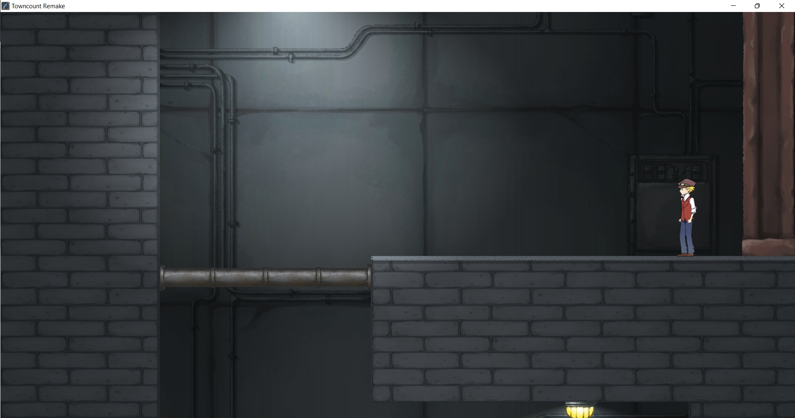

## TownCount Remake
Towncount is a 2D Metroidvania game, the main character can use his unique ability to explore the area and fight with monsters.

## Implemented Systems
1. 2D animation system that supports loops and different frame rates.
2. Data loader that reads JSON files and generates stage and creature classes.
3. A Collision Detection system that can return which side is collided.
4. Sprite renderer using Texture Mapping with OpenGL, which splits each frame into sprites for animations (changing UV buffer).
5. Stage manager that the player can interact with different connected stages.
6. Finite-State Machine for controlling player states, which also can easily extend new states.
7. Sound manager using bass.h
8. Deferred Key system for adding tolerance to player inputs.
9. Debug system for visualizing the collision range.
10. Camera that chases the player and clamps the position depending on the stage size. 
11. Direct light change over time in the background.
12. Dissolve shader applies when the enemy has died, and it dissolves over time.
13. Unique ability: He can use his chain to drag himself closer to the terrain.

# 1.2D Sprites and Animations
I make a Finite-State Machine for controlling player animations and states.

