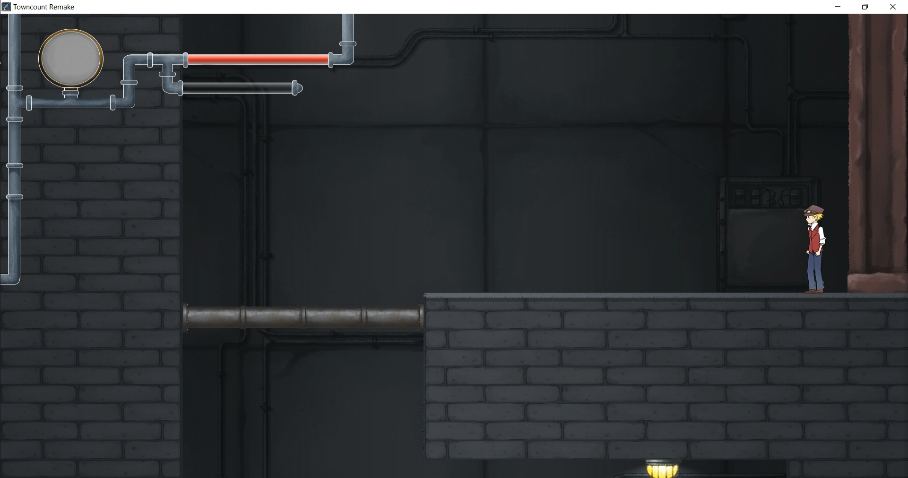

# TownCount Remake
Towncount is a 2D Metroidvania game, the main character can use his unique ability to explore the area and fight with monsters.

## Demo (click the image to watch the video)

# Implemented Systems
1. 2D animation system that supports loops and different frame rates.
2. Data loader that reads JSON files and generates stage and creature classes.
3. A Collision Detection system that returns which side is collided, and resolves collided object's position.
4. Sprite renderer using Texture Mapping with OpenGL, which splits each frame into sprites for animations (changing UV buffer).
5. Stage manager that the player can interact with different connected stages.
6. Polynomial Finite-State Machine for controlling player states, which also can easily extend new states.
7. Sound manager using bass.h
8. Deferred Key system for adding tolerance to player inputs.
9. Debug system for visualizing the collision range.
10. Camera that chases the player and clamps the position depending on the stage size. 
11. Different types of lights change over time in the background (can mix point lights & direct lights).
12. Dissolve shader applies when the enemy has died, and it dissolves over time.
13. Unique ability: He can use his chain to drag himself closer to the terrain.
14. Physics system for acceleration and deceleration
15. Monsters' AI for attacking and moving.
16. Render-To-Texture for full screen shader.
17. Basic UI system.
18. Synchronizing with monitor refreshes without vsync using deltaTime. (kinda works)

# Libraries 
Only use OpenGL for the Graphic programming(glm,
glfw, and glew libraries), the rest of the game is made from scratch.
Extra libraries: 
1. The stb library to load png and jpg files. [https://github.com/nothings/stb](https://github.com/nothings/stb)
2. The json library to load JSON files. [https://github.com/nlohmann/json](https://github.com/nlohmann/json) 
3. The sound library bass.h.

Sound only work on windows OS cause the bass library.

# 1.2D Sprites and Animations
Use Finite-State Machine for controlling player/monster animations and states.

## Idle

## Run

## 3 Combo Attack

## Jump

## Jump Attack

## Damaged

## Died

## Rats & Snails
The animation also applies to monsters, which have a similar state as the player(Idle, Run, Attack, Damaged, etc).

## UI
HP bar with frame.

## Health bar decreasing

# 2. Collision Applies to Game Mechanics
It can detect whether multiple rectangles are collied, and return which side has collided: left, right, top, or bottom.
It applies to player movements and, creature hitboxes, the trigger box to the next stage, and the unique ability that the chain interacts with the tube and wall.

## Exploration

## Attack Monsters

## Chain

# 3. 2D Light and Shadow
Different types of light that can change its intensity over time.

## Direct Lights

## Point Lights

# 4. 2D Shaders
There are many shaders in this game, like drawing sprites and lines, light shader, and one can dissolve the sprites over time.  

## Dissolve Shader

# Extra tasks

# Chain
The unique ability can interact with tubes and walls, which allows the player to explore the stage, without this, we won't able to go back to the beginning point. The most important machinic in the Metroidvania games is the player can go back and forth the area.

# Full screen shader
When the player is damaged, it applies the whole screen blur effect, and decreases the effect over time. The Render-To-Texture method is used so it can apply the whole screen shader.

## Blur

## Fade in Transition

